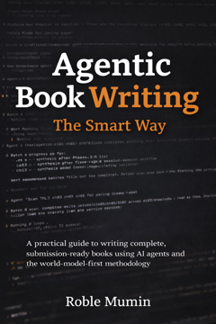

# agenticbook-starter

  

A reader-facing companion repository for *Agentic Book Writing: The Smart Way*.

This repo is designed to feel like a practical extension of the book: you can follow a reading route, open the matching files, and execute immediately.

## Start Here

If you only read one section, use this one.

| You are here | Open this first | Then go to |
|---|---|---|
| New to the method | [`guides/00_reader_routes.md`](guides/00_reader_routes.md) | [`guides/01_first_session.md`](guides/01_first_session.md) |
| Ready to execute now | [`guides/01_first_session.md`](guides/01_first_session.md) | Flavor card in [`quickstart/`](quickstart/README.md) |
| Reading the book and need file mapping | [`guides/02_book_bridge.md`](guides/02_book_bridge.md) | Matching folder in this repo |

## Reader Routes (Book Style)

- `GREEN` (sequential mastery): start with routes, then first session, then flavor card, then example docs.
- `YELLOW` (practitioner shortcut): choose flavor, copy blank templates, run generation and verification passes.
- `RED` (reference mode): jump to the exact artifact you need by chapter or task.

Full route details: [`guides/00_reader_routes.md`](guides/00_reader_routes.md)

## Choose Your Flavor

- Short (`<=40K`, 4-6 docs, 15-20 sessions): [`quickstart/short.md`](quickstart/short.md)
- Topic (`50-80K`, 8-12 docs, 30-50 sessions): [`quickstart/topic.md`](quickstart/topic.md)
- Novel (`80K+`, 15-25+ docs, 65-95 sessions): [`quickstart/novel.md`](quickstart/novel.md)

## What You Can Use Immediately

### Worked Examples

- Short example world model: [`docs/`](docs/00_index.md)
- Topic example world model: [`topic-example/`](topic-example/00_index.md)
- Novel example world model: [`novel-example/`](novel-example/00_index.md)

### Blank Templates

- Short blanks: [`blank/`](blank/00_index_blank.md)
- Topic blanks: [`topic-blank/`](topic-blank/00_index_blank.md)
- Novel blanks: [`novel-blank/`](novel-blank/00_index_blank.md)

### Prompt and Build Packs

- Static prompt library: [`prompts/README.md`](prompts/README.md)
- Tool setup and build notes: [`tools/README.md`](tools/README.md)

## Book-to-Repo Bridge

Use this when reading a chapter and you want the exact companion files:

- Chapter bridge: [`guides/02_book_bridge.md`](guides/02_book_bridge.md)
- Quick-start cards (Appendix C mirror): [`quickstart/README.md`](quickstart/README.md)
- Prompt library (Appendix D mirror): [`prompts/README.md`](prompts/README.md)
- Tool guides (Appendix B mirror): [`tools/README.md`](tools/README.md)

## Boundary and Canon

This starter kit is instructional.

It is **not** the production world model for the manuscript and it is **not** the canonical source for manuscript claims.

For canonical methodology claims, use the manuscript repository and production world model.

## Quality Alignment

- Flavor thresholds: Short `<=40K`, Topic `50-80K`, Novel `80K+`
- Calibration: apply `x0.85`; never trust single-pass scoring
- Verification depth scales by flavor (Short lite, Topic full, Novel full + fiction-specific)
- Graduate from starter when drift and context overhead are recurring

## Versioning

This companion repo tracks the active release line of the book.

- Use this repository's Releases page for stable snapshots.
- If manuscript references and repo structure differ, follow the latest release notes in this repository.
- Methodology canon remains in the manuscript and production world model.

## Book

*Agentic Book Writing: The Smart Way* by Roble Mumin  
https://roblemumin.com
